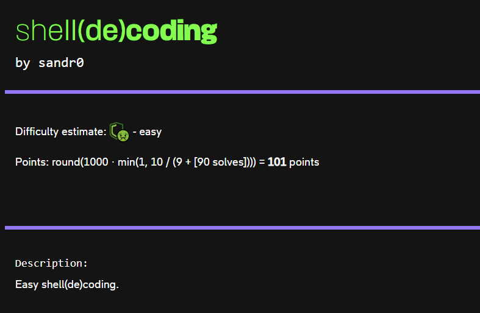
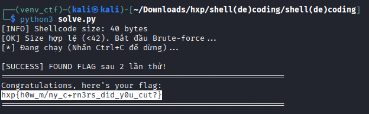

# Shell(de)coding

# Description

Category: Msc



**Goal:** Write an x64 shellcode to perform Base64 decoding within 42 bytes.

# Analysis

I am provided with a Python script (`emu.py`) that utilizes the **Unicorn Engine** to emulate x86-64 machine code.

### The Environment

The script sets up the emulation environment as follows:

- **Input (`RSI`):** Points to a randomly generated Base64 string (derived from 32 random bytes).
- **Output (`RDI`):** Points to a writable memory buffer where I must store the decoded result.
- **Length (`RDX`):** Contains the length of the input string (approximately 44 bytes).

### The Constraints

1. **Size Limit:** The shellcode must be **strictly less than 42 bytes**.
2. **Instruction Limit:** Execution stops after 2000 instructions (prevents heavy brute-forcing).
3. **Validation:** The emulator compares the memory at `RDI` (our output) with the original random secret.
4. **Error Handling:** The emulator runs inside a `try...except` block. If the shellcode crashes (e.g., reads out of bounds), the script catches the exception and proceeds to verify the flag.

# Strategy

**The Base64 Problem**
Base64 decoding involves converting 4 ASCII characters (4 × 6 bits) back into 3 binary bytes (3 × 8 bits).
The standard Base64 table maps ASCII to indices (0-63):

- `A-Z` → 0-25
- `a-z` → 26-51
- `0-9` → 52-61
- `+` → 62
- `/` → 63

**The Challenge**
Implementing a full lookup table or a complete `if-else` chain to handle all character ranges (`A-Z`, `a-z`, `0-9`, `+`, `/`) requires significantly more than 42 bytes.

**Mine Optimization Strategy:**

1. **Ignore Special Characters (`+` and `/`):** Since the input is generated randomly using `secrets.token_bytes(32)`, there is a statistical probability that the generated Base64 string will contain *only* alphanumeric characters. We can write a shorter shellcode that handles only `A-Za-z0-9` and brute-force the connection until we get a "lucky" input.
2. **Arithmetic Mapping:** Instead of lookup tables, I use arithmetic logic to map ASCII values to their Base64 indices.
3. **Crash to Exit:** Instead of wasting bytes on a `ret` or `syscall exit`, we simply let the loop run until it reads invalid memory. The `try...except` block in `emu.py` handles the crash gracefully.

# Solution

We need to map the ASCII values to indices using minimal instructions:

- **Logic:**
    1. Subtract `65` (`'A'`).
    2. If the result is negative, it was a digit (`0-9`). We add a constant to shift it to the range `52-61`.
    3. If positive, we check if it is greater than `25`. If so, it was lowercase (`a-z`), so we subtract `6` to bridge the gap between `Z` and `a`.

```c
/* Initialization */
    xor ebx, ebx        ; Clear accumulator buffer
    /* RDX already contains length, we just increment it later */

next_char:
    lodsb               ; Load byte from [RSI] into AL, increment RSI

    /* --- Mapping Logic --- */
    sub al, 65          ; Subtract 'A'
    jge check_upper     ; If >= 0, it's a letter (A-Z or a-z)
    
    /* Case: Digit (0-9) */
    add al, 75          ; Adjust negative value to range 52-61

check_upper:
    /* Case: Letter */
    cmp al, 25          ; Compare with ('Z' - 'A')
    jle accumulate      ; If <= 25, it's uppercase (Correct 0-25)
    
    /* Case: Lowercase (a-z) */
    sub al, 6           ; Adjust to range 26-51

accumulate:
    /* Bit Shuffling */
    shl ebx, 6          ; Shift buffer left by 6 bits
    or  bl, al          ; Add the new 6 bits to the buffer

    /* Loop Control */
    inc edx             ; Increment counter
    test dl, 3          ; Check if we have processed 4 chars (24 bits)
    jnz next_char       ; If not, continue loop

    /* Write Output */
    mov eax, ebx        ; Move 24 bits to EAX
    bswap eax           ; Swap bytes to match memory layout (Big Endian logic)
    shr eax, 8          ; Remove the empty trailing byte
    stosd               ; Write 4 bytes to [RDI]
    dec rdi             ; Rewind 1 byte (we only wanted to write 3 bytes)
    
    jmp next_char       ; Infinite loop (until crash)
```

# Exploit

```c
#!/usr/bin/env python3
from pwn import *
import sys

# Configuration
context.log_level = 'error' # Reduce noise
context.arch = 'amd64'

# The 40-byte Shellcode
shellcode_asm = """
    xor ebx, ebx
next_char:
    lodsb
    sub al, 65
    jge check_upper
    add al, 75
check_upper:
    cmp al, 25
    jle accumulate
    sub al, 6
accumulate:
    shl ebx, 6
    or  bl, al
    inc edx
    test dl, 3
    jnz next_char
    mov eax, ebx
    bswap eax
    shr eax, 8
    stosd
    dec rdi
    jmp next_char
"""

# Compile
payload = asm(shellcode_asm)
print(f"[*] Shellcode Length: {len(payload)} bytes")

if len(payload) >= 42:
    print("[!] Payload too long!")
    sys.exit(1)

print("[*] Starting Brute-force (waiting for alphanumeric-only token)...")

attempt = 0
while True:
    attempt += 1
    try:
        # Connect to local docker or remote server
        r = remote('127.0.0.1', 20148)
        
        # Send payload
        r.sendlineafter(b"hex:\n", payload.hex().encode())
        
        # Check response
        response = r.recvall(timeout=1)
        
        if b"hxp{" in response:
            print(f"\n[+] Success on attempt {attempt}!")
            print(f"[+] Flag: {response.decode().strip()}")
            break
        
        r.close()
        
        if attempt % 10 == 0:
            print(f"\r[~] Attempt: {attempt}", end="")
            
    except KeyboardInterrupt:
        break
    except:
        pass
```

# Result



Flag → `hxp{h0w_m/ny_c+rn3rs_did_y0u_cut?}`
